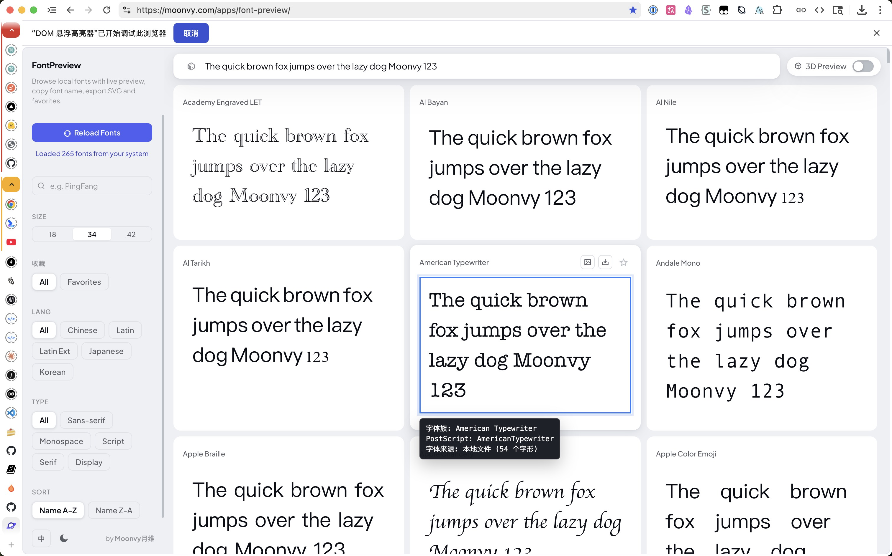

# Font Picker


Font Picker is a WXT-based Chrome MV3 extension for inspecting page elements and
the fonts they actually render with.



## Browser Support

This extension only supports Google Chrome.

It relies on Chrome's `debugger` permission and Chrome DevTools Protocol method
`CSS.getPlatformFontsForNode` to read rendered font data. Firefox and other
browsers are not supported.

## Features

- Click the toolbar icon to enter hover inspection mode.
- Hover a DOM element to draw a border around it.
- Inspect rendered font details including family name, PostScript name, font
  origin, and glyph count.
- Use `ArrowDown` and `ArrowUp` to move through overlapping elements.
- Press `Esc`, left-click, or right-click to exit inspection mode.
- Content script is injected on demand after the toolbar icon is clicked.
- UI strings are localized with WebExtension `_locales` for English,
  Simplified Chinese, and Traditional Chinese.

## Development

```sh
pnpm install
pnpm dev
```

To bump the patch version in `package.json`:

```sh
pnpm run bump
```

GitHub Releases are created from version tags. After bumping the version, create
and push a matching tag:

```sh
git tag v0.1.1
git push origin v0.1.1
```

The GitHub Action builds the Chrome MV3 extension, creates the WXT zip, and
uploads the zip to the tag's GitHub Release.

Load `.output/chrome-mv3` as an unpacked extension in Chrome.

Chrome may show a debugging notice while rendered font data is being read. This
is expected and cannot be hidden by the extension.
